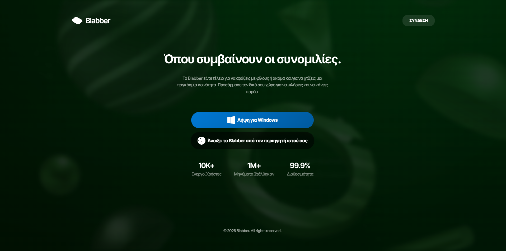
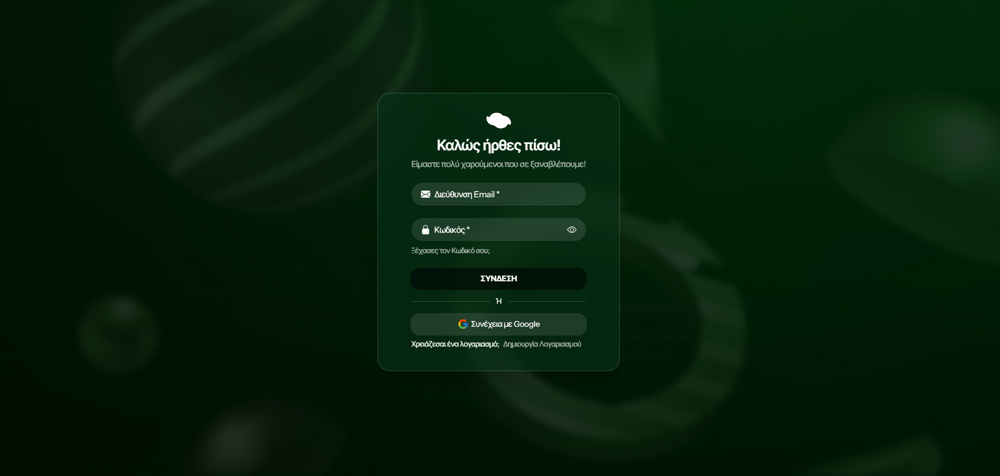
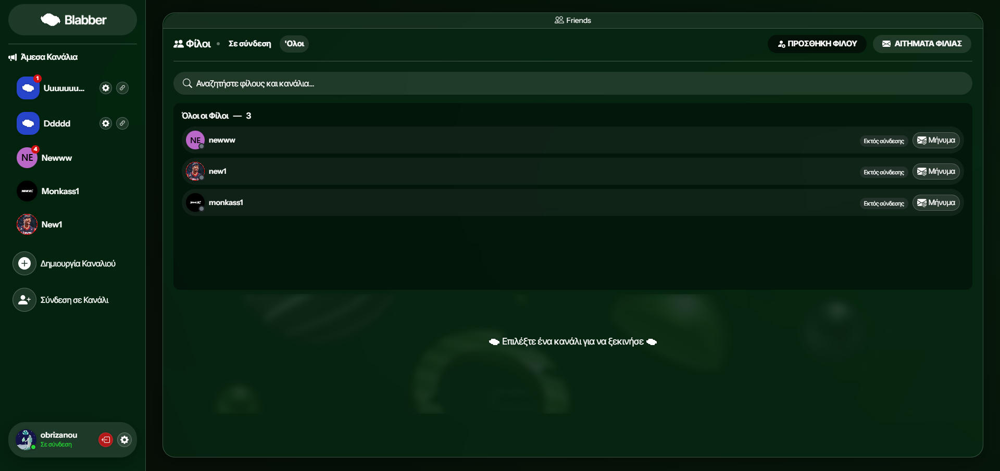
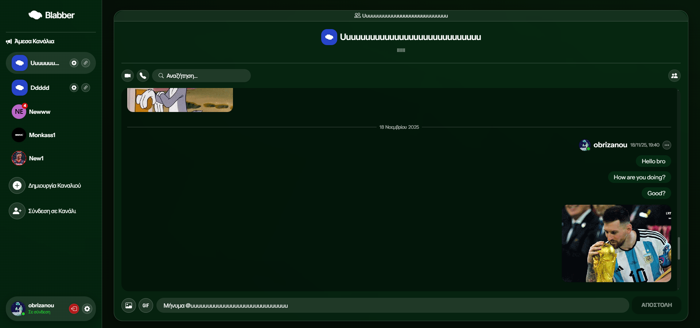
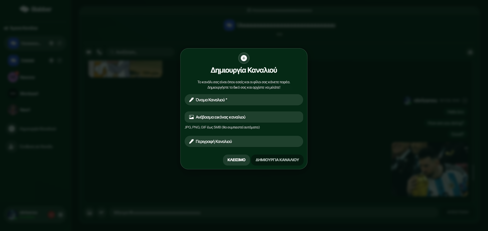
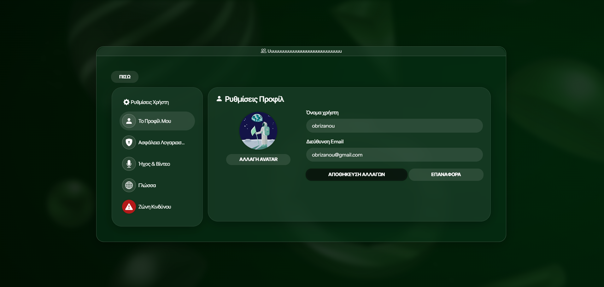

<h1 align="center">Blabber Chat</h1>
<h3 align="center">Real-Time Messaging Frontend Client (Discord-Inspired)</h3>

<p align="center">
  The production-ready frontend client for <strong>Blabber Chat</strong>, a real-time messaging application engineered for low-latency communication. This interface provides a highly responsive, dynamic user experience featuring state-driven channel layouts, live WebSocket event orchestration, and instant media-supported messaging capabilities.
</p>

<p align="center">
  <a href="https://blabber-chat.netlify.app/">
    
  </a>
  <a href="https://opensource.org/licenses/MIT">
    
  </a>
</p>

---

### ✨ Core Features

* **Event-Driven Bi-directional UI:** Native integration with WebSockets for real-time state synchronization, message rendering, and server-side push notifications without layout flashing or overhead fetching.
* **Desktop & Tablet Optimized Layouts:** A custom Discord-inspired multi-pane UI architecture that flawlessly handles sidebar channel hierarchies, active member rosters, and main chat spaces.
* **Scalable Component-Based Architecture:** Engineered with React and strong TypeScript primitives to achieve declarative UI states, predictable state management, and reusable UI components.
* **Dynamic Channel Navigation:** Smooth client-side routing and channel switching with contextual room caching to minimize fetch intervals between active conversations.
* **Real-Time Presence & State Triggers:** Low-overhead indicators displaying real-time visual feedback for typing status (`typing...`) and active peer connection metrics.

---

### 🛠️ Tech Stack

**Core UI & Type Safety**
<p align="left">
  
  
</p>

**Network Transport & Layout**
<p align="left">
  
  
  
</p>

---

### 📸 Application Showcase

<p align="center">
  
  
</p>
<p align="center">
  
  
</p>
<p align="center">
  
  
</p>

---

### 🚀 Getting Started

**1. Clone the repository:**
```bash
git clone https://github.com/filipposobrijanu/blabber-frontend.git
cd blabber-frontend
```

**2. Install dependencies:**
```bash
npm install
```

**3. Start the local development server:**
```bash
npm start
```
